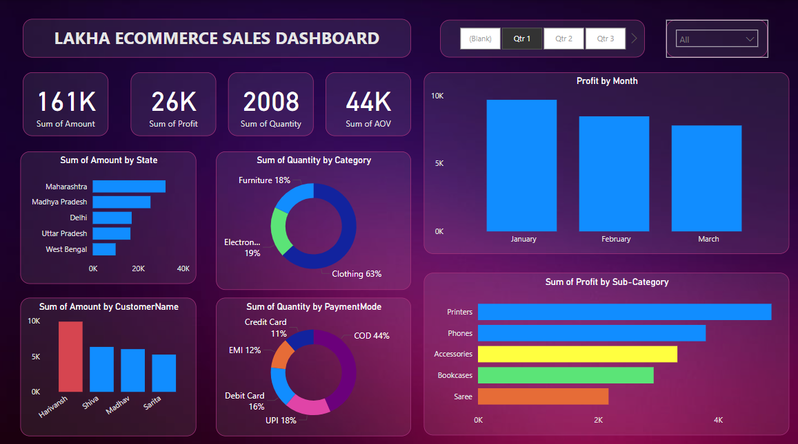

# 🛒 Ecommerce Sales Dashboard

This Power BI dashboard provides key insights into eCommerce sales performance, including sales amount, profit, quantity, category breakdown, customer insights, and more.

## 📊 Key Features

- 📍 Regional sales analysis (by state)
- 👥 Top performing customers
- 🛍️ Product category-wise quantity distribution
- 💰 Monthly profit tracking
- 💳 Payment mode analysis
- 🔍 Sub-category profit breakdown

## 📁 Files

- `Ecommerce Sales Dashboard (Power BI).pbix`: Power BI report file
- `Ecommerce Sales Dashboard.png`: Dashboard preview image

## 🚀 How to Use

1. Download the `.pbix` file.
2. Open in **Power BI Desktop**.
3. Refresh the dataset or connect to your own source.

## 🧠 Tools & Technologies

- Power BI
- DAX
- Data Modeling
- Data Visualization

## 📬 Contact

Feel free to reach out via [LinkedIn](https://www.linkedin.com/in/rohit-lakha/) 
